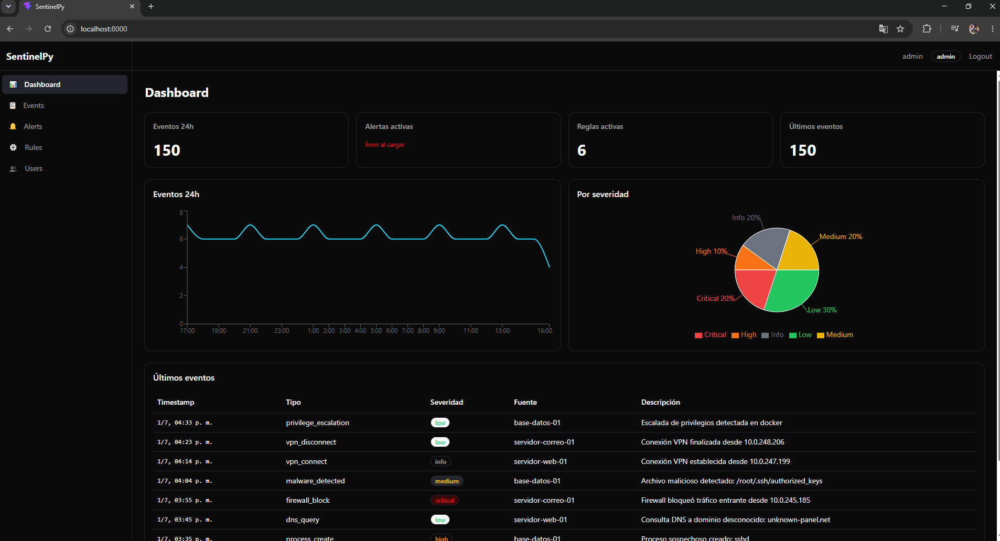
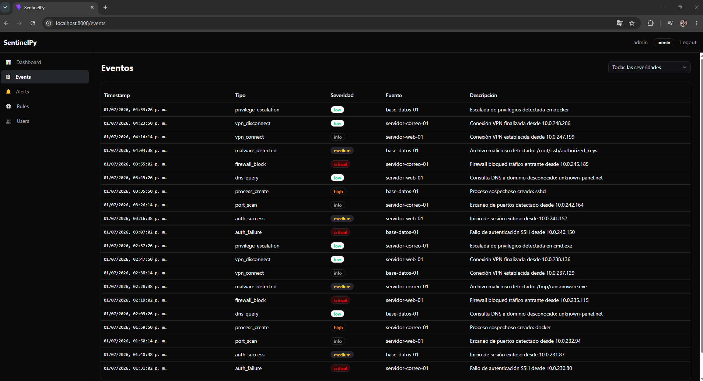
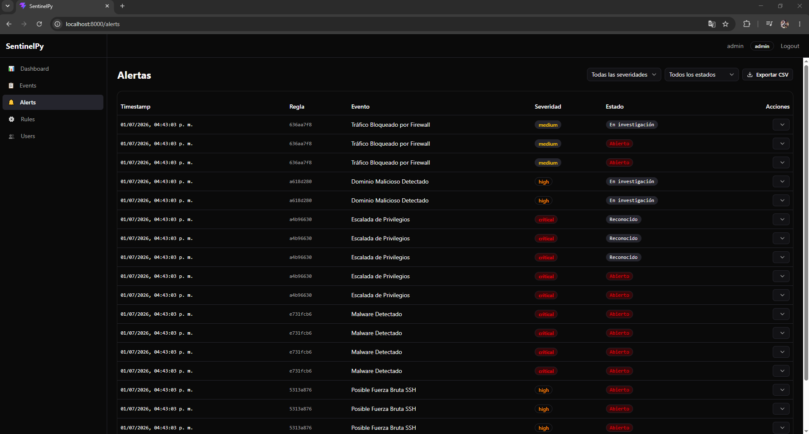
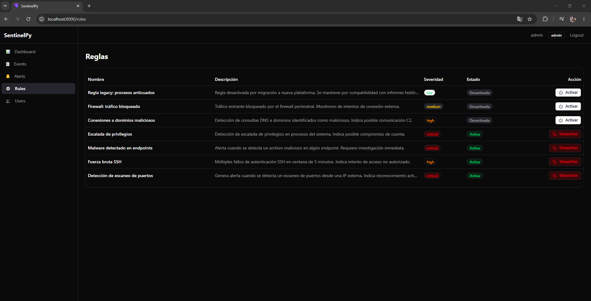

# SentinelPy 🔍

**SIEM ligero para PyMEs** — Python + FastAPI + React + PostgreSQL.

SentinelPy es un Security Information and Event Management diseñado para entornos de aprendizaje y pequeñas/medianas empresas. Colecta eventos de seguridad, los normaliza, corre reglas de correlación en tiempo real, y genera alertas con notificaciones por email/webhook.

---

## Capturas

| Pantalla | Preview |
|----------|---------|
| Dashboard |  |
| Eventos |  |
| Alertas |  |
| Reglas |  |

---

## Funcionalidades

| Feature | Descripción |
|---------|-------------|
| **Colector syslog** | Escucha en puerto 5140, recibe logs desde firewalls, servidores, y aplicaciones |
| **Parsers** | Normaliza logs crudos a un formato estructurado (SSH, firewall, DNS, procesos) |
| **Motor de correlación** | Reglas configurables que correlacionan eventos en ventanas temporales |
| **Alertas** | Generación automática con severidad, estado, y conteo de eventos relacionados |
| **Dashboard en vivo** | Charts de eventos por hora, distribución por severidad, últimas alertas |
| **Autenticación JWT** | Login con cookie httpOnly, sesión de 8 horas |
| **RBAC** | Dos roles: `admin` (CRUD usuarios, toggle reglas) y `analyst` (solo lectura) |
| **Notificaciones** | Email (SMTP) y webhook (Slack/Discord) para alertas de alta severidad |
| **Exportación CSV** | Descarga de alertas filtradas en formato CSV |
| **Modo producción** | Docker multi-stage con usuario no-root y SPA compilada |

---

## Stack

| Capa | Tecnología |
|------|-----------|
| Backend | Python 3.13+, FastAPI, Uvicorn |
| Base de datos | PostgreSQL 16 + SQLAlchemy 2.0 (async) + asyncpg |
| Migraciones | Alembic |
| Frontend | React 19 + TypeScript + Vite 8 |
| UI | shadcn/ui + Tailwind CSS v4 |
| Estado/Server | TanStack Query + React Router v7 |
| Charts | Recharts |
| Testing | pytest + pytest-asyncio + testcontainers (backend) |
| | Vitest + Testing Library (frontend) |
| Contenedores | Docker + Docker Compose |

---

## Inicio rápido

### Requisitos

- Docker + Docker Compose
- Git

### Levantar todo

```bash
git clone https://github.com/Dennis-9430/SentinelPy.git
cd SentinelPy

# Iniciar PostgreSQL + API
docker compose up -d

# La API sirve en http://localhost:8000
```

En ese puerto tenés:
- **SPA** — http://localhost:8000/ → Dashboard, Eventos, Alertas, Reglas, Usuarios
- **API** — http://localhost:8000/docs → Swagger UI
- **Health** — http://localhost:8000/health

### Credenciales por defecto

| Usuario | Rol | Contraseña |
|---------|-----|-----------|
| `admin` | Administrador | `admin123` |

El usuario admin se crea automáticamente al primer inicio. Podés crear usuarios analistas desde la interfaz (solo admin).

### Roles y permisos

| Recurso | Admin | Analyst |
|---------|-------|---------|
| Dashboard (stats, charts) | ✅ | ✅ |
| Eventos (ver, filtrar) | ✅ | ✅ |
| Alertas (ver, cambiar estado, exportar CSV) | ✅ | ✅ |
| Reglas (ver) | ✅ | ✅ |
| Reglas (crear, editar, eliminar) | ✅ | ❌ |
| Reglas (activar/desactivar) | ✅ | ❌ |
| Usuarios (ver, crear, desactivar) | ✅ | ❌ |

El rol **analyst** está pensado para operadores de seguridad que necesitan monitorear alertas y eventos en el dashboard, pero sin capacidad de modificar la configuración del sistema.

---

## Poblar con datos de demostración

Una vez que los contenedores están corriendo, ejecutá el seed script:

```bash
# Desde la raíz del proyecto
docker compose exec api python scripts/seed_demo_data.py
```

Esto genera:
- **7 reglas** de correlación (6 activas + 1 deshabilitada)
- **150 eventos** de prueba distribuidos en las últimas 24 horas
- **~20 alertas** en distintos estados (open, investigating, resolved)

> 💡 Después del seed, reiniciá el API para que el motor recargue las reglas:
> ```bash
> docker compose restart api
> ```

---

## Arquitectura

```
                    ┌──────────────────────────────────┐
                    │        React SPA (Vite)          │
                    │  Dashboard · Eventos · Alertas   │
                    │  Reglas · Usuarios · Login       │
                    └──────────────┬───────────────────┘
                                   │ HTTP (JSON)
                    ┌──────────────▼───────────────────┐
                    │       FastAPI (Uvicorn)          │
                    │  API REST · Auth JWT · Static    │
                    └──────┬───────────────────┬───────┘
                           │                   │
              ┌────────────▼──────┐    ┌───────▼──────────┐
              │  Correlation     │    │    PostgreSQL     │
              │  Engine (reglas) │    │  (SQLAlchemy)     │
              └────────▲─────────┘    └───────────────────┘
                       │
              ┌────────┴─────────┐
              │   Pipeline       │
              │  Parse → Engine  │
              └────────▲─────────┘
                       │
              ┌────────┴─────────┐
              │  SyslogCollector │
              │  (puerto 5140)   │
              └──────────────────┘
```

### Flujo de datos

1. **Colector** recibe logs por syslog en puerto 5140
2. **Pipeline** parsea y normaliza cada evento
3. **Engine** evalúa reglas de correlación contra el evento
4. Si una regla coincide → se crea o actualiza una **alerta**
5. Si la severidad lo amerita → **notificadores** envían email/webhook
6. Todo queda persistido en **PostgreSQL**
7. La **SPA** consulta los datos via API REST con autenticación JWT

---

## API REST

| Método | Ruta | Descripción | Auth |
|--------|------|-------------|------|
| `GET` | `/health` | Health check + reglas activas | ❌ |
| `POST` | `/api/auth/login` | Iniciar sesión | ❌ |
| `POST` | `/api/auth/logout` | Cerrar sesión | ✅ |
| `GET` | `/api/auth/me` | Usuario actual | ✅ |
| `GET` | `/api/events` | Eventos paginados (filtro por severidad) | ✅ |
| `GET` | `/api/events/stats` | Estadísticas (timeline + por severidad) | ✅ |
| `GET` | `/api/rules` | Reglas de correlación | ✅ |
| `GET` | `/api/rules/{id}` | Detalle de una regla | ✅ |
| `POST` | `/api/rules` | Crear nueva regla | admin |
| `PUT` | `/api/rules/{id}` | Actualizar regla | admin |
| `DELETE` | `/api/rules/{id}` | Eliminar regla | admin |
| `PATCH` | `/api/rules/{id}/toggle` | Activar/desactivar regla | admin |
| `GET` | `/api/alerts` | Alertas paginadas (filtros) | ✅ |
| `PATCH` | `/api/alerts/{id}/estado` | Cambiar estado de alerta | ✅ |
| `GET` | `/api/alerts/stats` | Estadísticas de alertas | ✅ |
| `GET` | `/api/alerts/exportar` | Exportar alertas a CSV | ✅ |
| `GET` | `/api/users` | Listar usuarios | admin |
| `POST` | `/api/users` | Crear usuario | admin |
| `PATCH` | `/api/users/{id}/deactivate` | Desactivar usuario | admin |

---

## Frontend — Rutas

| Ruta | Página | Descripción |
|------|--------|-------------|
| `/login` | Login | Inicio de sesión con JWT |
| `/` | Dashboard | Stats, charts de eventos/alertas, últimas alertas |
| `/events` | Eventos | Tabla paginada con filtro de severidad |
| `/alerts` | Alertas | Tabla paginada con filtros, cambio de estado, exportación CSV |
| `/rules` | Reglas | Listado, crear/eliminar reglas, toggle activar/desactivar (solo admin) |
| `/users` | Usuarios | CRUD de usuarios (solo admin) |

---

## Desarrollo local (sin Docker)

### Backend

```bash
cd backend

# Crear entorno virtual
python -m venv .venv
.venv\Scripts\activate  # Windows
source .venv/bin/activate  # Linux/Mac

# Instalar dependencias
pip install -r requirements.txt

# Copiar y ajustar configuración
cp .env.example .env

# Necesitás PostgreSQL corriendo localmente
# (o apuntar DATABASE_URL al contenedor Docker de la db)

# Iniciar en modo desarrollo
uvicorn app.main:app --reload --port 8000
```

### Frontend

```bash
cd frontend

# Instalar dependencias
pnpm install

# Iniciar dev server con proxy a la API
pnpm dev
# → http://localhost:5173 (proxy /api/* → localhost:8000)
```

---

## Testing

```bash
# Backend (desde backend/)
cd backend
pytest -v              # 167+ tests
pytest -v -k toggle    # Solo tests de toggle

# Frontend (desde frontend/)
cd frontend
pnpm test              # 4 tests (vitest)
pnpm test:watch        # Watch mode
pnpm lint              # Oxlint
```

Los tests de integración del backend usan **testcontainers** — levantan una PostgreSQL 16 temporal automáticamente.

---

## Modo producción

```bash
docker compose -f docker-compose.yml -f docker-compose.prod.yml up -d
```

Diferencias con el modo dev:
- Puerto de base de datos **no expuesto** al host
- `DEBUG=false` (sin logs de debug, sin hot-reload)
- La imagen ya tiene el frontend compilado (multi-stage)

### Variables de entorno importantes

| Variable | Default | Descripción |
|----------|---------|-------------|
| `SECRET_KEY` | `change-me-in-production` | Clave para firmar JWT — **cambiar en producción** |
| `DATABASE_URL` | (docker) | Connection string asyncpg |
| `DEBUG` | `true` | Modo debug |
| `ADMIN_USERNAME` | `admin` | Usuario admin por defecto |
| `ADMIN_PASSWORD` | `admin123` | Contraseña admin |
| `SMTP_HOST` | — | Servidor SMTP para notificaciones email |
| `WEBHOOK_URL` | — | URL de webhook (Slack/Discord) |

> ⚠️ `SECRET_KEY`: generá una nueva con `openssl rand -hex 32` o el script de Python:
> `python -c "import secrets; print(secrets.token_hex(32))"`

---

## Estructura del proyecto

```
SentinelPy/
├── backend/
│   ├── app/
│   │   ├── api/          # Routers FastAPI (events, rules, alerts, auth, users)
│   │   ├── models/       # SQLAlchemy models (Event, Rule, Alert, User)
│   │   ├── schemas/      # Pydantic schemas
│   │   ├── services/     # Lógica de negocio (engine, pipeline, notifiers)
│   │   ├── config.py     # Settings con pydantic-settings
│   │   ├── database.py   # async engine + session factory
│   │   ├── main.py       # App FastAPI + lifespan + SPA catch-all
│   │   └── auth.py       # JWT helpers
│   ├── scripts/
│   │   ├── seed_demo_data.py    # Datos de demostración
│   │   └── docker-entrypoint.sh # Entrypoint del contenedor
│   ├── tests/            # 17 archivos de test (unit + integración)
│   ├── alembic/          # Migraciones de base de datos
│   └── Dockerfile        # Multi-stage (frontend-builder → builder → runtime)
│
├── frontend/
│   ├── src/
│   │   ├── pages/        # 6 páginas (Login, Dashboard, Events, Alerts, Rules, Users)
│   │   ├── components/   # Layout, ProtectedRoute, SeverityBadge, shadcn/ui
│   │   ├── hooks/        # useAuth (AuthProvider)
│   │   ├── lib/          # api.ts (fetch wrapper), types.ts, utils.ts
│   │   ├── router.tsx    # React Router v7 con lazy loading
│   │   ├── assets/images/ # Capturas para el README
│   │   └── test/         # Setup + smoke tests
│   ├── package.json
│   └── vite.config.ts    # Vite + Vitest config
│
├── docker-compose.yml       # Desarrollo
├── docker-compose.prod.yml  # Override de producción
└── docs/                    # Documentación detallada por fase
```

---

## Documentación adicional

En `docs/` hay guías detalladas de cada fase del proyecto:
- Visión general del sistema
- Guía de instalación
- Fundamentos, colectores, motor de correlación
- Dashboard, autenticación, notificaciones
- Configuración productiva

---

---

## Estado del proyecto

| Fase | Descripción | Estado |
|------|-------------|--------|
| 01 | Fundamentos y estructura del proyecto | ✅ Completado |
| 02 | Colectores y parsing de logs | ✅ Completado |
| 03 | Motor de correlación de eventos | ✅ Completado |
| 04 | Dashboard web (React SPA) | ✅ Completado |
| 05 | Correlación temporal y gráficas | ✅ Completado |
| 06 | Autenticación y control de acceso (JWT + RBAC) | ✅ Completado |
| 07 | Notificaciones (email + webhook) | ✅ Completado |
| 08 | Configuración productiva (Docker multi-stage) | ✅ Completado |
| 09 | **Agente remoto** — Colector liviano para endpoints | 📅 Planificado |
| 10 | **IA y análisis** — Detección de anomalías con ML | 📅 Planificado |

### ✅ Lo que ya tiene el sistema

- API REST completa con FastAPI + PostgreSQL async
- Colector syslog UDP + parsers (SSH, firewall, DNS, procesos)
- Motor de correlación con reglas configurables y ventanas temporales
- React SPA con 6 páginas (Dashboard, Eventos, Alertas, Reglas, Usuarios, Login)
- Autenticación JWT con cookie httpOnly
- RBAC (admin/analyst) con guards en frontend y backend
- CRUD de reglas y usuarios desde la UI
- Exportación de alertas a CSV
- Notificaciones por email (SMTP) y webhook (Slack/Discord)
- Seed de datos de demostración
- Docker multi-stage (frontend compilado, usuario no-root)
- 167+ tests de backend + 4 tests de frontend

### 📅 Próximos pasos

1. **Agente remoto** — Cliente liviano en Python que monitorea logs locales y los envía al servidor central vía API segura. Ideal para desplegar en servidores, firewalls, y endpoints Windows/Linux.
2. **IA y análisis** — Detección de anomalías basada en comportamiento histórico (ML), generación automática de informes de seguridad, y recomendaciones de reglas.

---

## Licencia

Proyecto educativo — sin licencia formal.
